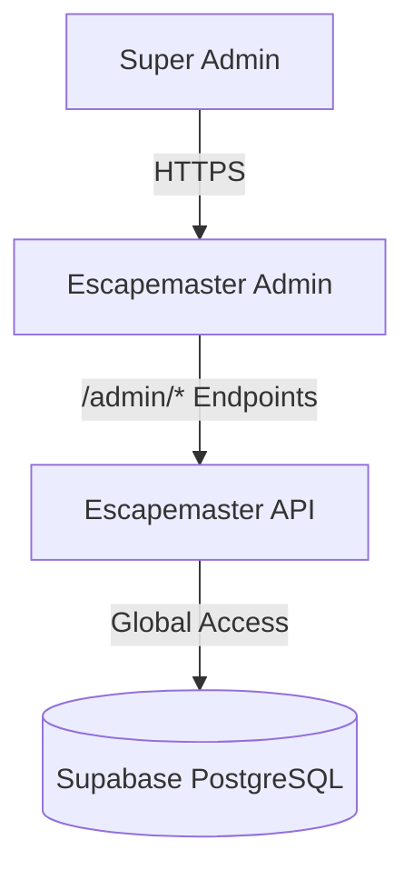

# 🛡️ Escapemaster Admin Architecture

## System Overview

Escapemaster Admin is a specialized Next.js application designed for the "Super Admin" persona. It bypasses standard tenant isolation to provide cross-organizational management capabilities.



## 🛠️ Tech Stack

| Component         | Technology      | Purpose                         |
| ----------------- | --------------- | ------------------------------- |
| **Framework**     | Next.js 16      | React framework with App Router |
| **Styling**       | Tailwind CSS v4 | Utility-first CSS               |
| **Data Fetching** | Axios           | HTTP Client                     |
| **Icons**         | Lucide React    | UI Icons                        |

## 📂 Project Structure

```
src/
├── app/                    # Routing Layer
│   ├── (auth)/             # Admin Login
│   ├── dashboard/          # Protected Admin Area
│   │   ├── organizations/  # Tenant CRUD
│   │   ├── users/          # Global User Search
│   │   └── widgets/        # Widget Registry
│   └── layout.tsx          # Root Layout
│
├── components/             # UI Layer
│   ├── ui/                 # Shared UI atoms
│   └── layout/             # Admin Sidebar/Header
│
├── services/               # Data Layer
│   ├── api.ts              # Axios instance
│   └── admin.service.ts    # Admin-specific API calls
```

## 🔐 Security Model

Unlike the Web app, the Admin app interacts with a specific set of API endpoints (typically prefixed with `/admin` or requiring `is_superuser` flag).

1.  **Authentication:** Uses the same JWT mechanism but validates a specific `role: 'superuser'` claim or permission set.
2.  **Authorization:** All routes in `(dashboard)` are protected by a `AdminGuard` component that checks for elevated privileges.

## 🚧 Pending Development Phases

### Phase 2: Management Features (Current)

1.  **Organization Management:**
    - List all organizations with status (Active/Suspended).
    - Create new organization (onboarding flow).
    - Edit organization limits (max rooms, max users).
2.  **Widget Registry:**
    - Interface to define new widgets available to tenants.
    - Configure default dimensions and data sources.

### Phase 3: Analytics & Billing

1.  **Platform Metrics:**
    - Dashboard showing total active organizations, MRR, and churn.
2.  **Stripe Integration:**
    - View and manage Stripe Customer IDs and Subscription statuses directly from the admin panel.
