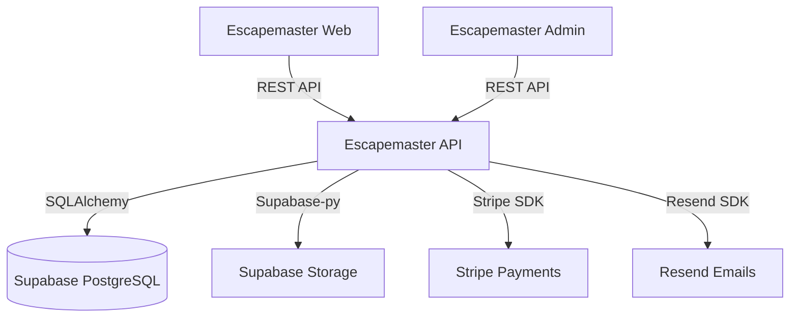

# 🏗️ Escapemaster API Architecture

## System Overview

The Escapemaster API serves as the central nervous system for the platform, connecting the client-facing applications (Web & Admin) with the data layer and external services.



## 🛠️ Tech Stack

| Component | Technology | Purpose |
|-----------|------------|---------|
| **Language** | Python 3.13 | Core logic execution |
| **Framework** | FastAPI | High-performance web framework |
| **Database** | PostgreSQL | Relational data storage (via Supabase) |
| **ORM** | SQLAlchemy 2.0 | Async database interactions |
| **Migrations** | Alembic | Database schema version control |
| **Validation** | Pydantic v2 | Data validation and serialization |
| **Auth** | JWT (python-jose) | Stateless authentication |

## 📂 Project Structure

The project follows a **Modular Monolith** architecture, organized by technical layers rather than features (though features are grouped within routes).

```
escapemaster-api/
├── app/
│   ├── main.py           # Application entry point & CORS config
│   ├── config.py         # Environment variable management (pydantic-settings)
│   ├── database.py       # Database connection & session management
│   │
│   ├── models/           # SQLAlchemy ORM Models
│   │   ├── user.py       # User & Permission models
│   │   ├── organization.py # Tenant models
│   │   └── ...
│   │
│   ├── schemas/          # Pydantic Schemas (Request/Response DTOs)
│   │   ├── auth.py
│   │   ├── booking.py
│   │   └── ...
│   │
│   ├── routes/           # API Controllers (Endpoints)
│   │   ├── auth.py       # Login, Register, Password Reset
│   │   ├── bookings.py   # Reservation management
│   │   └── ...
│   │
│   ├── services/         # Business Logic Layer
│   │   ├── auth_service.py
│   │   ├── storage_service.py # Supabase Storage wrapper
│   │   └── ...
│   │
│   ├── dependencies/     # FastAPI Dependencies
│   │   └── auth.py       # get_current_user, check_permissions
│   │
│   └── utils/            # Shared utilities (hashing, dates)
```

## 🔐 Authentication & Security

- **JWT (JSON Web Tokens):** Used for stateless authentication.
- **Refresh Tokens:** Implemented to allow long-lived sessions without compromising security.
- **RBAC (Role-Based Access Control):**
  - **Permissions:** Granular actions (e.g., `users:create`, `bookings:read`).
  - **Roles:** Collections of permissions (e.g., `Admin`, `GameMaster`).
  - **Tenancy:** All data access is scoped to the user's `organization_id`.

## 🚧 Pending Development Phases

### Phase 2: Core Features (Current)
1.  **Advanced Permissions:**
    - Apply `@require_permission` decorator to all protected endpoints.
    - Ensure strict tenant isolation testing.
2.  **Payments Integration:**
    - Finalize Stripe Webhook handler (`/webhooks/stripe`).
    - Implement subscription status syncing with the database.
3.  **Notifications System:**
    - Create HTML templates for booking confirmations and reminders.
    - Integrate Resend for reliable delivery.

### Phase 3: Reliability & Scale
1.  **Testing Strategy:**
    - Unit tests for all Services.
    - Integration tests for all Routes.
    - Target: >80% code coverage.
2.  **CI/CD Pipeline:**
    - GitHub Actions for linting (Black/Flake8) and testing (Pytest).
    - Automated deployment to Railway/Render.
