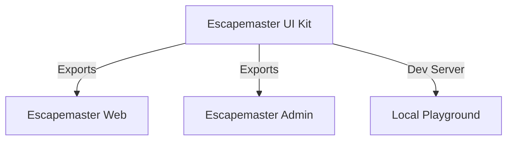

# 🎨 Escapemaster UI Kit Architecture

## System Overview

Escapemaster UI Kit is a centralized component library designed to enforce visual consistency across the Escapemaster ecosystem. It is built with React and Tailwind CSS and is intended to be consumed by both the Web and Admin applications.



## 🛠️ Tech Stack

| Component     | Technology        | Purpose                         |
| ------------- | ----------------- | ------------------------------- |
| **Framework** | Vite              | Fast build tool for development |
| **Library**   | React 18          | Component architecture          |
| **Language**  | TypeScript 5.3    | Type definitions for consumers  |
| **Styling**   | Tailwind CSS v3   | Utility-first styling           |
| **Bundler**   | Rollup (via Vite) | Packaging for distribution      |

## 📂 Project Structure

```
src/
├── components/             # Public Components
│   ├── Button/             # Atomic Component
│   │   ├── Button.tsx      # Implementation
│   │   └── Button.types.ts # Props Interface
│   ├── Forms/              # Form Elements
│   │   ├── Input.tsx
│   │   └── Select.tsx
│   └── index.ts            # Barrel file (Public API)
│
├── App.tsx                 # Development Playground
└── main.tsx                # Vite Entry Point
```

## 📦 Distribution Strategy

Currently, the UI Kit is consumed via Git submodule or direct repository cloning. The roadmap includes packaging it as a private NPM package.

1.  **Build:** `npm run build` generates a `dist/` folder with compiled JS and type definitions (`.d.ts`).
2.  **Consumption:** Consumer apps import components like `import { Button } from 'escapemaster-ui-kit'`.

## 🚧 Pending Development Phases

### Phase 2: Distribution (Current)

1.  **NPM Package:** Configure `package.json` with correct `main`, `module`, and `types` fields to support tree-shaking.
2.  **Tailwind Upgrade:** Upgrade to Tailwind v4 to align with the consuming applications (Web/Admin) and simplify configuration sharing.

### Phase 3: Documentation & Testing

1.  **Storybook:** Implement Storybook to provide an interactive documentation site for designers and developers.
2.  **Visual Testing:** Implement Chromatic or similar tools to catch visual regressions during PRs.
