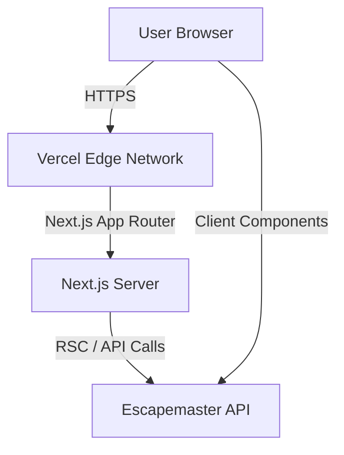

# 🖥️ Escapemaster Web Architecture

## System Overview

Escapemaster Web is a Single Page Application (SPA) built with Next.js that serves as the primary interface for end-users (staff and owners). It communicates with the Escapemaster API for all data operations.



## 🛠️ Tech Stack

| Component         | Technology      | Purpose                                |
| ----------------- | --------------- | -------------------------------------- |
| **Framework**     | Next.js 16      | React framework with App Router        |
| **Language**      | TypeScript 5    | Type safety                            |
| **Styling**       | Tailwind CSS v4 | Utility-first CSS                      |
| **State**         | Zustand         | Global client state (Sidebar, Widgets) |
| **Context**       | React Context   | Theme & Auth state                     |
| **Data Fetching** | Axios           | HTTP Client with interceptors          |
| **Drag & Drop**   | @dnd-kit        | Dashboard customization                |
| **Charts**        | Recharts        | Data visualization                     |
| **Testing**       | Playwright      | E2E Testing                            |

## 📂 Project Structure

The project uses the **Feature-Sliced Design** inspired structure within the Next.js App Router.

```
src/
├── app/                    # Routing Layer
│   ├── (auth)/             # Route Group: Authentication
│   │   ├── login/
│   │   └── register/
│   ├── (dashboard)/        # Route Group: Protected App
│   │   ├── bookings/
│   │   ├── settings/
│   │   └── page.tsx        # Dashboard Home
│   └── layout.tsx          # Root Layout (Providers)
│
├── components/             # UI Layer
│   ├── ui/                 # Atomic Design (Button, Input)
│   ├── domain/             # Business Components
│   │   ├── dashboard/      # Dashboard Widgets
│   │   └── bookings/       # Calendar, Lists
│   └── layout/             # Sidebar, Header
│
├── services/               # Data Layer
│   ├── api.ts              # Axios instance & interceptors
│   ├── auth.service.ts
│   └── booking.service.ts
│
├── store/                  # State Layer
│   └── use-sidebar-store.ts
│
└── context/                # Provider Layer
    ├── ThemeContext.tsx    # Theme switching logic
    └── AuthContext.tsx     # User session management
```

## 🎨 Theming System

The application implements a robust theming system using CSS Variables and Tailwind.

1.  **Definition:** Themes are defined in `ThemeContext.tsx` as objects containing color values.
2.  **Application:** The selected theme's values are injected into the `<body>` tag as CSS variables (e.g., `--color-primary`).
3.  **Usage:** Tailwind classes reference these variables (e.g., `bg-primary` resolves to `var(--color-primary)`).

## 🔐 Authentication Flow

1.  **Login:** User submits credentials to `/auth/login`.
2.  **Token:** API returns Access & Refresh tokens.
3.  **Storage:** Tokens are stored in `localStorage` (or HTTP-only cookies in future).
4.  **Interceptors:** Axios interceptor attaches `Authorization: Bearer <token>` to requests.
5.  **Refresh:** On 401 error, interceptor attempts to refresh token and retry request.

## 🚧 Pending Development Phases

### Phase 2: Integration (Current)

1.  **Widget Data Binding:** Connect `StatsCards`, `RevenueChart`, etc., to real API endpoints.
2.  **Settings Module:** Create forms for updating Organization details and managing Locations.
3.  **Booking Management:** Implement the full CRUD interface for bookings (Calendar View & List View).

### Phase 3: Advanced Features

1.  **Real-time Updates:** Integrate WebSockets (or Supabase Realtime) for instant booking notifications.
2.  **Offline Capabilities:** Service Workers for caching static assets and basic offline read access.
